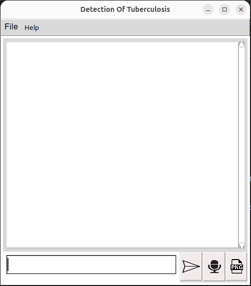
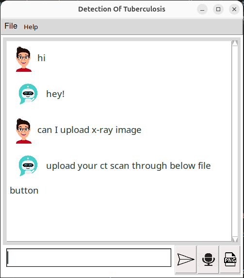
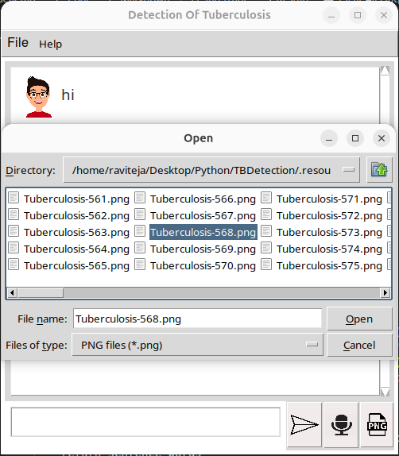
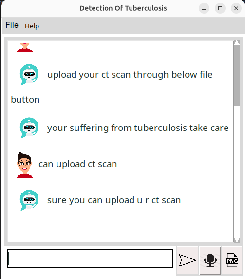
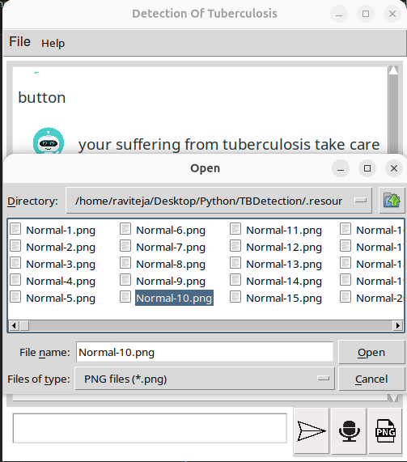
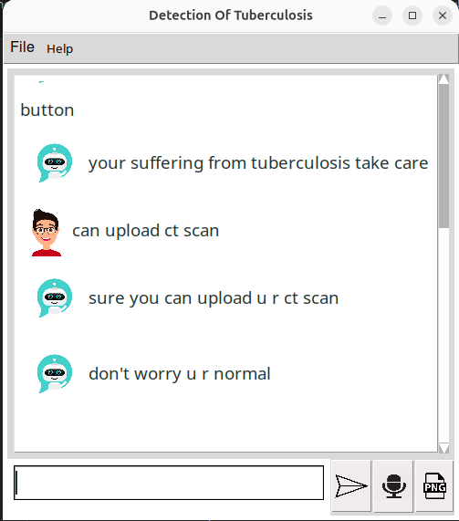

# TB Detection
 
## Project Structure
 
```
TBDetection/
├── .venv/
├── .resource/
│   ├── data/
│   │   ├── train/
|   |   |    ├── Normal
|   |   |    ├── Tuberculosis
│   │   └── validation/
|   |        ├── Normal
|   |        ├── Tuberculosis 
│   ├── intents.json
│   ├── words.pkl
│   ├── classes.pkl
│   ├── chatbotmodel.h5
│   └── tuberculosis.h5
├── src/
│   ├── tuberculosisModelTraining.ipynb
│   ├── trainingChatBot.ipynb
│   └── intractiveGui.ipynb
├── image/
│   ├── Microphone.png
│   ├── ChatBot.png
│   ├── File.png
│   ├── Human.png
│   └── Send.png
├── requirements.txt
└── README.md
```
 
## Data Setup
 
### Step 1: Download the Dataset
 
Download the TB X-ray dataset from Kaggle.

### Step 2: Create the Folder Structure

Create the following folder structure in the project directory:
 
- `.resource/` folder with:
  - `data/` folder with:
    - `train/` folder for training data
    - `validation/` folder for validation data
### Step 3: Split the Data
 
Split the downloaded data equally between the `.resource/data/train/` and `.resource/data/validation/` folders.
 
### Step 4: Add the Chatbot Intents File
 
In the `.resource/` folder, also include an `intents.json` file that contains conversation patterns and responses for training the chatbot. This file defines different conversation intents (like greetings, medical queries, symptom detection) and their corresponding user patterns and bot responses, which enables the chatbot to understand and respond to user queries intelligently.
 
**Example:**
 
```json
{
  "tag": "greetings",
  "patterns": ["hello", "hi", "hey"],
  "responses": ["Hello!", "Hi there!", "What can I help you with?"]
}
```
 
When a user types "hello" or "hi", the chatbot recognizes it as a "greetings" intent and responds with one of the predefined responses.
 
---
 
## System Setup
 
Before setting up the project, ensure you have Python 3.12 and required dependencies installed. Follow these steps:
 
### Step 1: Install Python 3.12
 
```bash
sudo add-apt-repository ppa:deadsnakes/ppa -y
sudo apt update
sudo apt install python3.12 python3.12-venv -y
```
 
### Step 2: Create Virtual Environment
 
```bash
cd ~/Desktop/Python/TBDetection
rm -rf .venv  # Remove existing .venv if any
python3.12 -m venv .venv
```
 
### Step 3: Activate Virtual Environment and Install Dependencies
 
```bash
source .venv/bin/activate
pip install -r requirements.txt
```
 
**Required Dependencies**
 
The `requirements.txt` file includes:
 
- `tensorflow` - Deep learning framework for model training
- `keras` - Neural network API
- `numpy` - Numerical computing
- `pandas` - Data manipulation
- `matplotlib` - Data visualization
- `nltk` - Natural language processing for chatbot
- `opencv-python` - Computer vision for image processing
- `pyttsx3` - Text-to-speech functionality
- `SpeechRecognition` - Speech-to-text functionality
### Step 4: Configure Jupyter Kernel for Notebooks
 
To run the Jupyter notebooks with the virtual environment, install and configure the IPython kernel:
 
```bash
pip install ipykernel
python -m ipykernel install --user --name=venv --display-name "Python (.venv)"
```
 
This creates a Python kernel linked to your virtual environment. When opening notebooks in VS Code or Jupyter, select the "Python (.venv)" kernel to ensure the correct dependencies are used.
 
### Step 5: Install GUI and Additional Dependencies
 
```bash
sudo apt install python3.12-tk -y
pip install requests
pip install --upgrade --force-reinstall pillow
```
 
- `python3.12-tk` - Required for Tkinter GUI support (used by the interactive chatbot interface)
- `requests` - HTTP library for making web requests
- `pillow` - Image processing library for enhanced image handling

### Images

The following screenshots document the TB Detection project workflow in chronological order. The images have been renamed and ordered as `step-01.png` through `step-06.png` to reflect the capture sequence.

- `image/step-01.png` — first screenshot in the workflow sequence
- `image/step-02.png` — second screenshot in the workflow sequence
- `image/step-03.png` — third screenshot in the workflow sequence
- `image/step-04.png` — fourth screenshot in the workflow sequence
- `image/step-05.png` — fifth screenshot in the workflow sequence
- `image/step-06.png` — sixth screenshot in the workflow sequence

#### Embedded Screenshots












